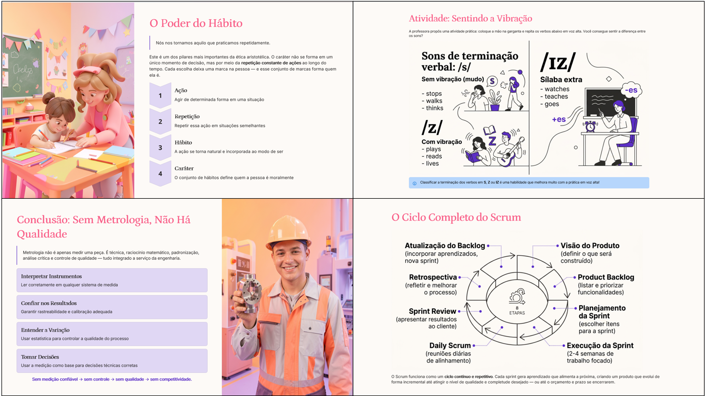
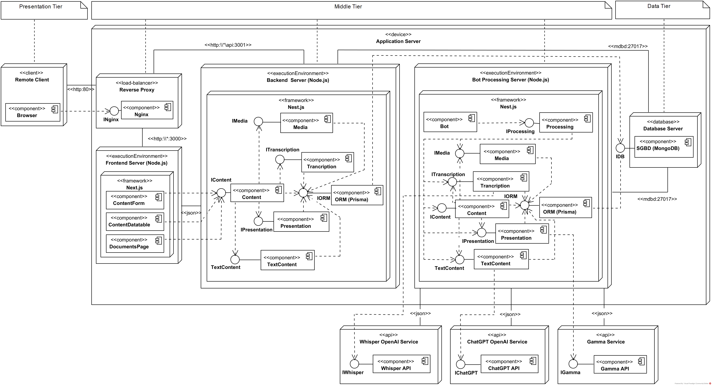
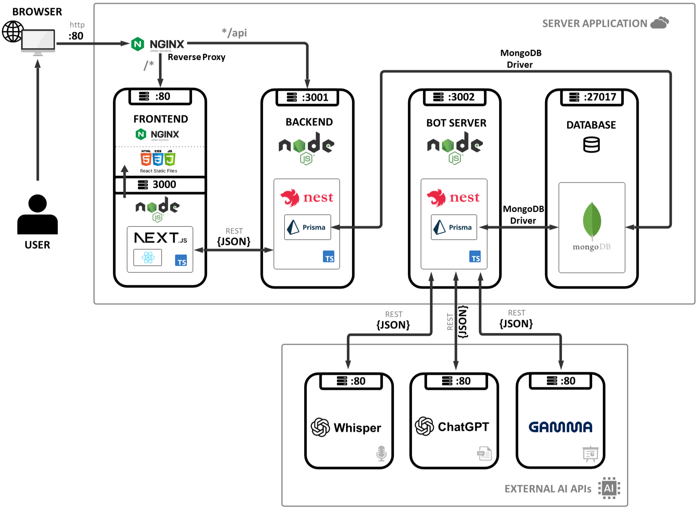
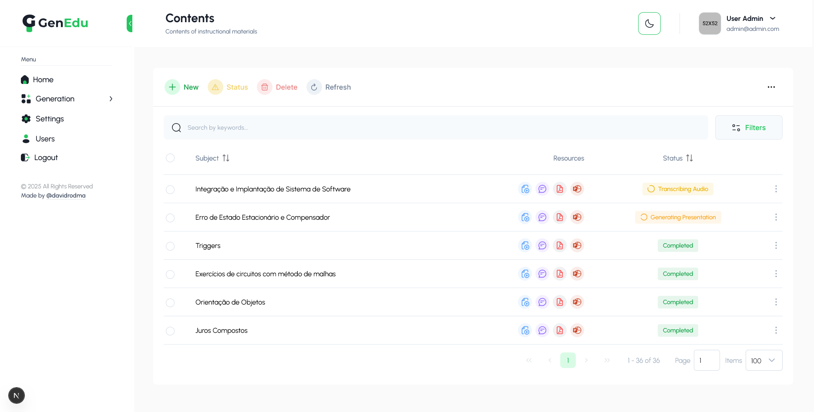

# GenEdu — Geração de apresentações por IA a partir de conteúdos audiovisuais

## Visão Geral

GenEdu é uma aplicação web que converte arquivos de áudio, vídeos ou links do YouTube em apresentações no estilo PowerPoint, usando Inteligência Artificial Generativa (IAGen). Esta ferramenta foi implementada exclusivamente para pesquisa de campo que resultou no manuscrito do artigo científico intitulado *"Geração de apresentações apoiada por Inteligência Artificial Generativa a partir de conteúdo de áudio"*. O processamento principal é composto por um pipeline que integra três APIs de IA:

- **Whisper:** modelo de transcrição de fala da OpenAI que converte arquivos de áudio em texto;
- **ChatGPT:** IAGen que recebe o texto transcrito e o prepara para o formato didático;
- **Gamma:** API da Gamma Tech Inc., para a composição de slides e a geração de imagens.

### Relevância

Os slides, em particular, são amplamente utilizados para orientar aulas presenciais, palestras, reuniões, seminários e cursos online, bem como para explicar conceitos e apoiar a exposição oral; no entanto, elaborar apresentações do tipo PowerPoint é uma tarefa que exige tempo, escrita, seleção de exemplos e imagens, edição de conteúdo e diagramação, considerando aspectos estéticos e cognitivos da comunicação. Em um contexto em que profissionais como professores e palestrantes acumulam múltiplas tarefas, ferramentas capazes de auxiliar na elaboração de apresentações podem contribuir para otimizar a elaboração desse material e apoiar o planejamento, já que o GenEdu é capaz de transformar o áudio ou vídeo gravado em pelo menos uma primeira versão de apresentação, aumentando a produtividade e reduzindo o esforço, a escrita, a estruturação, a diagramação e o tempo dedicado. As apresentações resultantes da GenEdu assemelham-se à da Figura 1 abaixo:

[](./presentations-examples.png)

## Arquitetura

O GenEdu foi desenvolvido na linguagem TypeScript, com o framework NestJS (v11), para o backend, e executado em duas instâncias de servidores Node.js: a primeira para receber as requisições do frontend e a segunda para que os bots realizem o processamento intensivo em segundo plano (conversão de áudio, transcrição, geração de conteúdo e criação de slides). Dessa forma, a fila de tarefas pesadas para as APIs Whisper, ChatGPT e Gamma é executada de forma assíncrona no segundo servidor, isolado do restante da aplicação. No frontend, utilizou-se o framework Next.js (v15, App Router) em outra instância do Node.js, o que permite executar componentes React no servidor quando necessário. Para a persistência de dados, utilizou-se o banco de dados NoSQL MongoDB, com o ORM Prisma.

### Diagramas Arquiteturais

A Figura 2 abaixo apresenta o diagrama de componentes da arquitetura implantada. A modelagem dos componentes serve para mostrar as interfaces que fazem a ponte entre o modelo lógico e o físico (nó) em tempo de execução. Na camada de apresentação (Presentation Tier), o cliente remoto (Browser) acessa o sistema REST via HTTP. A seguir, na camada de aplicação (Middle Tier), um Reverse Proxy (Nginx) realiza o roteamento para as instâncias internas, encaminhando requisições para o nó do Frontend Server (Node.js/Next.js) ou ao nó do Backend Server (Node.js/NestJS). As interfaces (ex.: IContent, IMedia, ITranscription, IPresentation) explicitam contratos entre os módulos. O Bot Processing Server é um nó independente que separa o processamento assíncrono do restante da aplicação, isolando em fila tarefas intensivas. Ainda neste nó, as integrações externas (OpenAI API e Gamma API) são tratadas como serviços consumidos por meio de interfaces, o que evidencia as dependências externas do sistema. Por fim, na camada de dados (Data Tier), o Database Server (MongoDB) é acessado por meio do componente de persistência ORM (Prisma), conforme ilustrado na Figura 2:

[](./deployment-diagram.png)

Para facilitar a compreensão das tecnologias empregadas, a Figura 3 abaixo apresenta a arquitetura do software em alto nível:

[](./high-level-diagram.png)


### Backend (NestJS)

- **Framework:** NestJS 11 + TypeScript
- **Banco de dados:** MongoDB com Prisma ORM (replica set obrigatório)
- **Processamento:** serviço bot em processo separado (`yarn bot:dev` / `yarn bot:prod`)
- **APIs externas:** OpenAI (Whisper + ChatGPT) e Gamma (apresentações)
- **Mídia:** download YouTube via `youtube-dl-exec` (yt-dlp); conversão com FFmpeg
- **Arquivos:** armazenamento local em `PATH_UPLOADS` (`medias/` e `docs/`)
- **Chaves de IA:** configuradas no painel (tabela `Config`), não via variáveis de ambiente
- **Instalação:** [server/README.md](./server/README.md)

### Frontend (Next.js)

- **Framework:** Next.js 15 (App Router) + React 19
- **UI:** PrimeReact + Tailwind CSS + Sass
- **Formulários:** React Hook Form
- **Autenticação:** JWT em cookie `auth.token` (Bearer nas requisições)
- **Painel:** dashboard, conteúdos, documentos gerados, usuários, configuração e settings
- **Instalação:** [client/README.md](./client/README.md)

Screenshot da interface gráfica do painel da ferramenta GenEdu (Figura 4):

[](./genedu-panel.png)

## Funcionalidades (v1.0)

### Pipeline de processamento

1. Entrada de mídia (link YouTube ou upload de áudio/vídeo)
2. Download da mídia (quando YouTube)
3. Conversão/extração de áudio para MP3 (FFmpeg)
4. Transcrição com Whisper (OpenAI)
5. Geração de texto didático com ChatGPT
6. Solicitação e geração de slides com Gamma
7. Download do PPTX e disponibilização no painel

### Personalização da apresentação

- Temas do Gamma (carregados via API)
- Quantidade de slides (`numCards`)
- Opções de imagem (IA, Unsplash ou sem imagens)
- Idioma do conteúdo e prompts personalizados (texto e apresentação)

### Painel administrativo

- CRUD de conteúdos com status do pipeline
- Visualização e download de texto e apresentação (`/panel/generation/contents/documents/[id]`)
- Gestão de usuários (papéis USER/ADMIN)
- Configuração dinâmica (incluindo chaves OpenAI e Gamma)
- Tema claro/escuro

## Pipeline e status

```
PENDING (0)
→ DOWNLOADING_MEDIA (1)
→ CONVERTING_AUDIO (2)
→ TRANSCRIBING_AUDIO (3)
→ GENERATING_TEXT (4)
→ REQUEST_PRESENTATION (5)
→ GENERATING_PRESENTATION (6)
→ DOWNLOADING_PRESENTATION (7)
→ COMPLETED (8)

Estados especiais: ERROR (9), CANCELED (10), PARTIAL (11)
```

O bot executa, em loop, os passos 1–7 do módulo `processing`, com intervalo de ~1s entre ciclos.

## Início rápido

### Pré-requisitos

- Node.js 18+ e Yarn
- MongoDB com replica set
- FFmpeg no PATH
- Contas/chaves OpenAI e Gamma (cadastradas depois no painel)

### Instalação

```bash
git clone <url-do-repositorio>
cd genedu
```

**Backend**

```bash
cd server
yarn install
cp .env.example .env
cp .env.development.example .env.development
# Ajuste DATABASE_URL, JWT_SECRET, PATH_UPLOADS, PORT, BOT_PORT
yarn generate
yarn mongo-migrate:up
yarn dev          # API em :3001
```

**Bot** (outro terminal)

```bash
cd server
yarn bot:dev      # bot em :3002 (BOT_PORT)
```

**Frontend** (outro terminal)

```bash
cd client
yarn install
# .env.development → NEXT_PUBLIC_API_URL=http://localhost:3001/api
yarn dev          # UI em :3000
```

Após o primeiro acesso, configure em **Configuration** as chaves `openai-api-key` e `gamma-api-key`.

### Variáveis de ambiente relevantes

**Backend (`server/.env` + `.env.development`)**

```bash
DATABASE_URL=mongodb://localhost:27017/genedu
JWT_SECRET=your_jwt_secret_here
PORT=3001
BOT_PORT=3002
PATH_UPLOADS=../client/public/uploads/
MAX_MB_UPLOAD=200
```

**Frontend (`client/.env.development`)**

```bash
NEXT_PUBLIC_API_URL=http://localhost:3001/api
```

> Chaves OpenAI/Gamma **não** vão no `.env`: ficam no MongoDB (`Config`), editáveis pelo painel.

Detalhes de desenvolvimento, padrões e troubleshooting: [DEVELOPMENT.md](./DEVELOPMENT.md). Contexto para o Cursor/IA: [.cursorrules](./.cursorrules).

## Estrutura do repositório

```
genedu/
├── server/                 # NestJS — API + bot
│   ├── src/modules/        # auth, user, config, api, content, media,
│   │                       # transcription, text-content, presentation,
│   │                       # processing, bot
│   ├── prisma/             # schema.prisma
│   └── migrations/         # mongo-migrate-ts
├── client/                 # Next.js — painel
│   ├── src/app/(admin)/    # auth + panel
│   ├── src/app/(website)/  # home (redireciona ao sign-in)
│   └── public/uploads/     # medias/ e docs/ (não versionar conteúdo)
├── DEVELOPMENT.md
├── .cursorrules
└── .gitattributes          # PrimeReact SCSS marcado como vendored
```

## Comandos principais

| Onde | Comando | Uso |
|------|---------|-----|
| server | `yarn dev` | API (watch) |
| server | `yarn bot:dev` | Bot (watch) |
| server | `yarn generate` | Atualiza Prisma Client |
| server | `yarn mongo-migrate:up` | Aplica migrations |
| server | `yarn build` / `yarn start:prod` | Produção API |
| server | `yarn bot:prod` | Produção bot |
| client | `yarn dev` / `yarn build` / `yarn start` | Frontend |

**Importante:** não use `prisma db push` em banco com dados (perigoso no MongoDB). Prefira `yarn generate` + `mongo-migrate-ts`.

## Configuração auxiliar

### MongoDB (replica set)

```yaml
# mongod.conf / mongod.cfg
replication:
  replSetName: rs0
```

```javascript
// mongosh
rs.initiate()
```

### FFmpeg

- Windows: https://ffmpeg.org/
- macOS: `brew install ffmpeg`
- Linux: `sudo apt install ffmpeg`

### Deploy (resumo)

1. Build de `server` e `client`
2. Variáveis de produção e `PATH_UPLOADS` apontando para storage persistente
3. PM2: `pm2 start pm2.config.js` e `pm2 start pm2-bot.config.js`
4. Nginx como reverse proxy (frontend + `/api` → Nest)
5. Replica set MongoDB e SSL conforme o ambiente

## Segurança

- Autenticação JWT + papéis USER/ADMIN
- Senhas com bcrypt
- Validação de upload (tipo/tamanho via `MAX_MB_UPLOAD`)
- Segredos e chaves de IA fora do código-fonte versionado (env + Config no banco)

## Licença

UNLICENSED — uso conforme os termos definidos pelo autor do projeto.

**Autor:** [David Rodma](https://github.com/davidrodma/)
